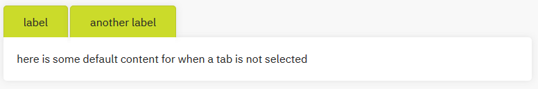
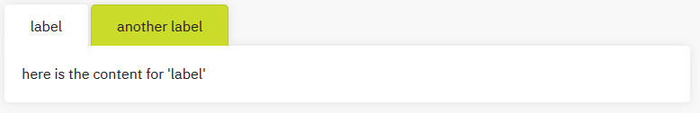

Documentation
=============

This contains guidance on how to write documentation in this repository.

# Markdown Files
Markdown files in the src directory use standard markdown syntax to document each concept. Each concept should live in its own file.
For example, `Pipeline` and `FlowData` have their own files.

## Code Fencing

When including fenced code blocks using ` ``` ` above and below, the language to use when highlighting is taken from the file
by default. For documentation files, this will be markdown. So when writing language code blocks, the language should be added
in brackets like `{java}`. There must also be no space after the backticks. For example, for an XML block one would write:
````
```{xml}
<top>
    <middle>
    </middle>
</top>
```
````

## DoxyGen Tags
Each markdown file must have certain definitions inside for them to be handled correctly by DoxyGen.

### @page
Each page must be declared with a ``@page`` tag giving it a unique identifier, and a page name which need not be unique. For example, the `Pipeline` page is defined with

``` md
@page Concepts-Core-Pipeline Pipeline
```

where the unique id is its location inside the documentation structure (this is just convention and does not affect the output), and the name of the page is a more friendly name.

### @subpage
Each subpage must be declared in its parent page using the ``@subpage`` tag and the unique identifier of the 
subpage. For example, the `Pipeline` page lives under the `Core` page, so the `Core` page contains

``` md
@subpage Concepts-Core-Pipeline
```

This sets up the subpage, and adds a link to the parent page. The text used for the link can be given as a second argument to the ``@subpage`` tag, but by default it is the friendly name of the subpage.

### @mainpage
The main page (`main.md`) is defined using the ``@mainpage`` tag. This is the same as the ``@page`` tag, but ensures this is the main page, and is always at the top of the navigation.

### @ref
Links to pages (or anything else which DoxyGen can link to e.g. classes) can be added using the ``@ref`` tag inside a markdown link. For example, to link to the `Pipeline` page use

``` md
[some link text](@ref Pipeline)
```

and the ``@ref`` tag will be replaced with the correct URL.

### @htmlonly and @endhtmlonly
Pure HTML can be added to a markdown file by surrounding it with the ``@htmlonly`` and ``@endhtmlonly`` tags.

### @dotfile
Used to generate and include a graph from a dot file which must be in the `graphs` directory. Graphs should be in files and
included in this way rather than being added directly to the page.

### @anchor
Used to add an anchor to a location in the page which can be linked to. Linking to an anchor links to the page, then scrolls to the anchor.

# Example Grabber
The `examplegrabber.js` file is used to load language specific examples onto a general example page. The file must be included in a ``<script>`` tag, then buttons and a ``<div>`` must be set up correctly.

All pages have the JavaScript is included already with

``` html
<script type="text/javascript" src="examplegrabber.js"></script>
```

from the `header.html` file.

## External Examples

A button can be added to view the example in Java:

``` html
<button class="b-btn b-btn--secondary examplebtn" onclick="grabExample(this, 'pipeline-java','hash_2_getting_started_8java')">Java Code</button>
```

There are a few things to note here:
* the class must be ``"b-btn b-btn--secondary examplebtn"``. ``"b-btn"`` makes it a button, ``"b-btn--secondary"`` makes it unselected, and ``"examplebtn"`` is used to identify it to the ``grabExample`` method;
* the ``onclick`` event is what sets up the button to load the example using the ``grabExample`` method defined in `examplegrabber.js`. The arguments are:
	* ``this`` enables that button to appear selected by removing the ``"b-btn--secondary"`` class;
	* ``'pipeline-java'`` is the name of the repository which the example lives in (this must have the same prefix as this repository);
	* ``'hash_2_getting_started_8java'`` is the name of the example to load. The actual name of the page will end in ``'-example.html'``, but this will be added by the method.

Then a ``<div>`` with the id ``"grabbed-example"`` can be added which the ``examplegrabber`` will load the example into:

``` html
<div id="grabbed-example"></div>
```

The HTML loaded will come from the ``g-docs__primary`` div on the target page which will have the id ``"primary"``.

Any links on the page (e.g. to classes which are documented in the target repository) are fixed so they point to the correct URL.

### Aliases

The following aliases are available to make including example simpler (these do not need to be surrounded by ``@htmlonly``):

| Alias | Meaning |
| ----- | ------- |
| `@grabexample{project,name,label}` | `<button class=\"b-btn b-btn--secondary examplebtn\" onclick=\"grabExample(this, 'project', 'name')\">label</button>` |
| `@grabbedexample` | `<div id=\"grabbed-example\"></div>` |


## Inline Snippets

Inline snippets can be included with tabs select which snippet to display. These are available in the following aliases:

| Alias | Description |
| ----- | ----------- |
| `@startsnippets` | start a block containing tabs and snippets |
| `@showsnippet{name,label}` | add a tab to display the content with the name 'name' |
| `@showsnippet{name}` | same as above where the label is the same as the name |
| `@startsnippet{name}` | start a snippet which will be displayed when its tab is selected. The content can be markdown |
| `@startsnippet{name,display}` | same as above where the 'display' style is set. This is 'none' by default to hide it until the tab is selected |
| `@endsnippet` | end the snippet |
| `@emptysnippet` | insert an empty snippet which is displayed until a tab is selected |
| `@defaultsnippet{text}` | insert a snippet which is displayed until a tab is selected. The content will be the text argument |
| `@endsnippets` | end the whole snippets block |

The following example shows how to set up a single tab with some content, and some default text for when no tabs
are selected.

```
@startsnippets
@showsnippet{name,label}
@showsnippet{anothername,another label}
@defaultsnippet{here is some default content for when a tab is not selected}
@endsnippet
@startsnippet{name}
here is the content for 'label'
@endsnippet
@startsnippet{anothername}
here is the content for 'another label'
@endsnippet
@endsnippets
```

**NOTE**: There must only be line breaks between ``@startsnippet`` and ``@endsnippet``, all others must be on consecutive lines.

This is output as shown in the images below.




# Graphs
The GraphViz tool uses the dot language to generate graphs. Each graph should be stored in its own file in the `graphs` directory.

For consistency, all graphs should have the following properties:
* transparent background
* Helvetica font
* size 10 font
* default arrow and node style

A simple example of a graph looks as follows:

``` js
digraph ExampleGraph {
    // Set the background to transparent
    bgcolor=transparent;
    // Place nodes left to right
    rankdir=LR;
    // Style the nodes
    node [shape=record, fontname=Helvetica, fontsize=10];
    // Style the arrow labels
    edge [fontname=Helvetica, fontsize=10];
    
    // Add two nodes
    Node1 [label=Node1, URL="@ref Node1_page"];
    Node1 [label=Node2, URL="@ref Node2_page"];

    // Add an edge between the nodes
    Node1 -> Node2 [label="an optional label"];
}
```

and will be output as:


The following example includes a few more complicated parts as a reference:

``` js
digraph ExampleGraph {
    // Set compound to true to allow ending edges
    // at the node group
    compound=true;

    // Set the background to transparent
    bgcolor=transparent;
    // Style the nodes
    node [shape=record, fontname=Helvetica, fontsize=10];
    // Style the arrow labels
    edge [fontname=Helvetica, fontsize=10];
    
    // Add a node
    Node1 [label=Node1];
    
    // Add a node group (name must start with "cluster")
    subgraph clusterParentNode {
        label="Parent Node";
        fontname=Helvetica;
        fontsize=10;
        
        // Add two nested nodes
        Node2 [label=Node2];
        Node3 [label=Node3];
    };

    Node4 [label=Node4];

    // Add some edges
    Node1 -> Node2 -> Node3 -> Node1;
    // Add an edge to the parent node with no arrow
    Node4 -> Node2 [lhead=clusterParentNode, arrowhead=none];
}
```

and will be output as:


Graphs are included on a page using the ``@dotfile`` tag like
```
@dotfile some-graph.gvdot
```

[More on the dot language in GraphViz](https://graphviz.gitlab.io/documentation/)

# Aliases

The `Doxygen` file contains useful aliases (mainly for links). These are stored as a list in the ``ALIASES`` configuration option.

For example, a link to the flow data page is written as

```
[flow data](@ref Concepts_Data_FlowData)
```

so the alias:

```
flowdata=[flow data](@ref Concepts_Data_FlowData)
```

means that the link can instead be written as

```
@flowdata
```

This makes writing page links simpler, and more difficult to write incorrectly, and enforces conventions (e.g. `flow data`, not `FlowData` or `Flow Data`).

Any extra pages that are added should have an alias added to the `Doxyfile`. It is also worth adding capitalized versions too. For example, if a link to
flow data was at the start of a sentence, `@Flowdata` can be used instead of `@flowdata`.


# Headings and Anchors

The main sections of a page should use a single hash (`#`), then subheadings 2, etc.

Top level sections (`#`) have a different styling to the rest, so should be used to lay out the main structure of a page.

`@anchor` is mainly used with headings which start a section which may be linked to. For example, the terminology page has terms which will be linked to.
So a heading has an anchor like:

```
# Some Term @anchor Concepts_Terminology_SomeTerm
```

where the naming convention is the page, then the heading in camel case.

An alias exists for terms on the terminology page and linking to the above example would be done like:

```
[link text](@term{SomeTerm})
```


# Tag Files
To enable linking to this documentation from other repositories, tag files must be included in their `Doxyfile` using the `TAGFILES` property.

This means that any links which are possible here are also possible from the documentation which includes the tag file. With this as a git submodule under the directory `doc-src`, including the tag file with the line

``` txt
doc-src/tagfile=../../documentation/4.0
```
any link to a member of the general documentation will be included with the prefix `../../documentation/4.0` (the path to the repository).

# DoxygenLayout.xml
This contains the structure of the navigation. First there is the main page (defined by the ``@mainpage`` tag), then pages (defined with ``@page`` and ``@subpage`` tags), then the static links to the language specific documentation (these are hardcoded with the repository names).


# General Standardization
All headings should be written in Title Case. e.g. 'Last of the Mohican's'

Use single quotation when  enclosing text.

Use American English for spellings.

All terms should use the same format as the 51Degrees glossary, for capitals, hyphenation etc.

# Generating
## Dependencies
### DoxyGen
We use a customised build of DoxyGen.
The source code is available from the [DoxyGen](https://github.com/51Degrees/doxygen) repository. However, building from source can be [fiddly](https://www.doxygen.nl/manual/install.html).
Pre-built binaries can be downloaded from Sharepoint for [Linux](https://51degrees.sharepoint.com/:u:/r/Product%20Team/doxygen-linux.zip?csf=1&web=1&e=fTWXlN) or [Windows](https://51degrees.sharepoint.com/:u:/r/Product%20Team/doxygen-win.zip?csf=1&web=1&e=T7MvWo).  The Linux pre-buit binaries also live in the [Tools Repo](https://github.com/51Degrees/tools/tree/main/DoxyGen).  

### GraphVis
In order for DoxyGen to generate nice diagrams, [GraphVis 2.38](https://graphviz.gitlab.io/_pages/Download/windows/graphviz-2.38.msi) must be installed.

### Pattern Lab
The css used in all documentation comes from the pattern lab submodule.

To generate the `main.min.css` needed by the documentation, follow the installation instructions in the [PatternLab readme](patternlab/README.md) to generat the css, then run ``gulp minify-css`` to minify it. The minified css will now live in `patternlab/source/css`.
