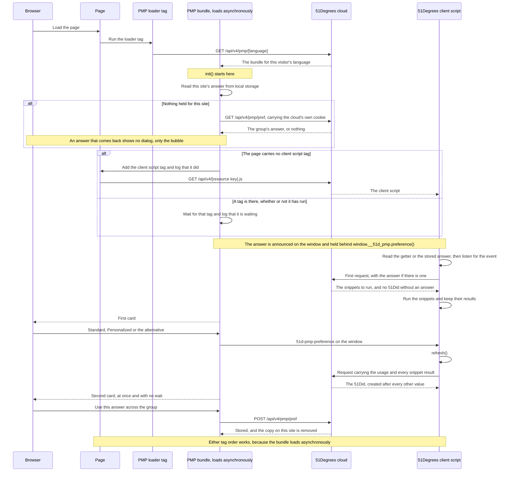

@page Identifiers_PMP PMP (Preference Management Platform)

The Preference Management Platform (PMP) is a small piece of JavaScript you
add to your pages with one `<script>` tag. It asks each visitor how they
want their data used for marketing, keeps the answer, and makes that answer
available to the rest of the page. The answer is one of three values, and
those three values are exactly the `id.usage` values the 51Degrees cloud
takes, so nothing has to be translated between the dialog and the service.

The platform does two things a publisher cannot easily do alone. It asks the
question in the visitor's own language, and it can carry the answer across
the other websites in a group you name, so a visitor who has already
answered on one of your sites is not asked again on the next one.

The answer the visitor gives is what allows a @ref Identifiers_51Did to be
created. The identifier is created by the cloud only after every other value
on the page has been resolved, and only when an answer is present, so a page
where nobody was asked produces no identifier at all.

# What the Visitor Sees

1. **The first card.** A dialog asking how the visitor wants marketing to
   work. It offers Personalized, the alternative you configure (for example
   'Subscribe' or 'Remove ads'), and Standard when you turn Standard on.
   There is no close cross, so the only way past it is to answer it.
2. **The second card.** When the first answer was Standard or Personalized,
   and your settings allow it, a second card asks whether the answer should
   apply to the other sites in the group you named. It follows the first
   card at once, with nothing in between. See @ref Identifiers_PMP_Sharing.
3. **The bubble.** After answering, the dialog collapses to a small bubble
   in the corner. Clicking the bubble reopens the dialog so the visitor can
   change their answer whenever they like. A returning visitor whose answer
   is already known sees the bubble and no dialog.

# The Three Answers

| Answer | What the visitor chose | Value sent to the cloud |
|---|---|---|
| Personalized | Personalized advertising and targeted content | `personalized` |
| Standard | Frequency capping and measurement only | `standard` |
| The alternative button | The visitor takes what you offer instead of marketing | `non-marketing` |

All three are answers, and each one creates a 51Did carrying that usage.
The alternative button is not a refusal to answer and it is not a failure
path. It records that the visitor declined marketing, which is worth
knowing, because another site in the group can then offer its own
alternative rather than asking a question the visitor has already answered.
What each answer permits is set out in the Model Terms for Marketing,
version 2, at <https://m4ow.uk/mtm/2.txt>. See
@ref Identifiers_PMP_Preferences.

# The Pieces on the Page

- **The loader tag**, which is the one `<script>` tag you write. It reads
  your settings from its own attributes and pulls in the bundle those
  settings call for.
- **The bundle**, which is the platform itself, built for one language and
  loaded asynchronously. Because it is asynchronous, it can finish loading
  before or after anything else on the page.
- **The 51Degrees client script**, which is the script that gathers the
  page's values and asks the cloud for its answers, publishing them on a
  page object named `fod` by default. It listens for the platform's answer
  by itself, so you write no code to join the two. Where your page carries
  no client script tag, the platform adds one. See
  @ref Identifiers_PMP_Integration.
- **The cloud**, which serves the loader, the bundle and the client script,
  holds a shared answer when the visitor agrees to share one, and creates
  the 51Did.

# The Load Process

The diagram below is the common case, being a visitor who has not answered
before and who answers the first card after the client script has already
made its first request. That order is the normal one and not a recovery
path.

## The Same Sequence in Words

1. The loader tag runs, reads your attributes, and asks the cloud for the
   bundle in the visitor's language.
2. The bundle starts and reads this site's stored answer.
3. Finding none, and where you allow sharing, it asks the cloud for the
   group's answer. That request carries the cloud's own cookie, which is a
   third party cookie, so it works only in browsers that allow one. When an
   answer comes back the visitor sees no dialog, only the bubble.
4. Where the page carries no 51Degrees client script tag, the platform adds
   one from the same cloud that served it, using the resource key it already
   holds, and says so in the console. Where a tag is there it waits for it,
   run or not, and adds nothing.
5. Any answer in force is announced on the window and is also available from
   `window.__51d_pmp.preference()`, which answers straight away.
6. The client script reads whatever is available when it is built, registers
   for the platform's event, makes its first request, and runs the snippets
   the cloud asks for. On the common path there is no answer yet, so that
   first request creates no 51Did.
7. The visitor answers the first card. The platform announces the answer.
8. The client script hears the announcement and refreshes itself. That
   request carries the usage and every snippet result, so the 51Did is
   created after every other value is known.
9. The second card follows the first at once. Nothing waits for the cloud
   and nothing waits for the client script.
10. If the visitor agrees to share, the platform writes the answer to the
    cloud and removes the copy held on this site, so there is one answer and
    never two.

Either tag order works. The bundle is loaded asynchronously, so putting the
platform's tag above or below the client script's tag changes nothing about
the outcome. The client script takes whatever answer is available when it is
built and listens for one arriving later.

# In This Section

@subpage Identifiers_PMP_Integration

@subpage Identifiers_PMP_Preferences

@subpage Identifiers_PMP_Sharing

@subpage Identifiers_PMP_IsGdpr

@subpage Identifiers_PMP_CmpWiring

@subpage Identifiers_PMP_Configuration

@subpage Identifiers_PMP_Privacy

# Find Out More

- The identifier the answer leads to: @ref Identifiers_51Did
- Passing the identifier into header bidding: @ref Integrations_Prebid
- The Model Terms for Marketing, version 2, which is what the three answers
  mean in contract: <https://m4ow.uk/mtm/2.txt>
- The client script and the browser data it gathers:
  <https://github.com/51Degrees/javascript-templates>
- Build or check a resource key: <https://configure.51degrees.com/>
- What each plan includes: <https://51degrees.com/pricing>
- Ask us about the licence key the marketing usages need:
  <https://51degrees.com/contact-us>
